<!-- Panels load from ./assets. Upload README.md AND the assets/ folder together, or the images will not render. -->
<div align="center">

</div>

<div align="center">

`[ 00 CONSOLE ]` `[ 01 SKILL GRAPH ]` `[ 02 SIGNAL RADAR ]` `[ 03 PIPELINE ]` `[ 04 CAREER ]` `[ 05 WORK MATRIX ]` `[ 06 CHANNELS ]`

</div>

<table>
<tr>
<td width="190" align="center" valign="top">
<a href="https://haseebkn.vercel.app/"></a>
<br><sub><code>SUBJECT SCAN / LIVE</code></sub>
</td>
<td valign="top">

```text
 OPERATOR ...... Muhammad Haseeb (Haseeb Khan)
 ROLE .......... Senior Shopify / React.js Developer @ Markloops
 BASE .......... Islamabad, Pakistan
 STACK ......... React.js, Next.js, TypeScript, JavaScript, HTML, CSS
 COMMERCE ...... Shopify Plus, Liquid, WordPress, WooCommerce
 BACKEND ....... Supabase, Clerk, PostgreSQL        PYTHON ... exploring
 RECORD ........ 100+ projects / 20+ Shopify + WP builds / 4+ years
 STATUS ........ available for new engagements
```

</td>
</tr>
</table>

<a href="https://haseebkn.vercel.app/"></a>

<br>


<br>

<details open>
<summary><code>SUBSYSTEM 01 :: SKILL GRAPH</code> &nbsp;<sub>(expand / collapse)</sub></summary>


```diff
+ tier.languages : HTML, CSS, JavaScript, TypeScript   (Python: exploring)
+ tier.frontend  : React.js, Next.js, Redux Toolkit, Tailwind CSS, SCSS
+ tier.platforms : Shopify, Liquid, WordPress, Supabase, Clerk
+ tier.delivery  : Vercel, Netlify, Git / GitHub
# every glowing path is a real chain I ship with: language -> framework -> platform -> deploy -> product
```

</details>

<details open>
<summary><code>SUBSYSTEM 02 :: SIGNAL RADAR</code> &nbsp;<sub>(expand / collapse)</sub></summary>


> Distance from core = years in production, derived from my experience timeline (05/2022 to now). Python is amber because I am still exploring it, not shipping it.

</details>

<details open>
<summary><code>SUBSYSTEM 03 :: SHIPPING PIPELINE</code> &nbsp;<sub>(expand / collapse)</sub></summary>


<details>
<summary><code>&gt; inspect working principles</code></summary>

```yaml
definition_of_done: "not when it works, when it holds up"
standards:
  - clean, maintainable code
  - performance that survives real traffic (Lighthouse 60s -> 90+)
  - interfaces that still feel right six months after launch
ai_toolchain:
  claude_code: "Max plan - rapid implementation, safe refactors"
  cursor: "Pro plan - AI-first editing across large codebases"
  rule: "AI speeds up the build. The architecture decisions stay mine."
```

</details>

</details>

<details open>
<summary><code>SUBSYSTEM 04 :: CAREER TELEMETRY</code> &nbsp;<sub>(expand / collapse)</sub></summary>



```text
 2022-05 .. 2023-07   UPTEK         Frontend Developer
                      React.js + Shopify Liquid, Figma to pixel-accurate UI, Git + code review
 2023-07 .. 2024-10   NODE AGENCY   Senior React.js / Next.js Developer
                      10+ client projects, frontend architecture, mentored 2 juniors, Lighthouse 60s -> 90+
 2024-10 .. NOW       MARKLOOPS     Senior Shopify / React.js Developer
                      Shopify Plus storefronts, checkout + metafields, React internal tooling
```

</details>

<details open>
<summary><code>SUBSYSTEM 05 :: WORK MATRIX</code> &nbsp;<sub>(expand / collapse)</sub></summary>


<details>
<summary><code>&gt; open process table (live links)</code></summary>

<br>

**SHOPIFY**

[Wear London](https://wear-london.com/) | [Hudson Valley Fisheries](https://hudsonvalleyfisheries.com/) | [Nulastin](https://nulastin.com/) | [Payet Maison](https://payetmaison.com/) | [Her Height](https://www.herheight.com/) | [BarGear](https://bargear.eu/) | [Happy Day Pets](https://www.happydaypets.com/) | [GolfTailor](https://www.golftailor.eu/) | [Beach Weekend](https://beachweekend.com/) | [Sulene Serenity](https://suleneserenity.com/) | [More Hair Organics](https://morehairorganics.com/) | [Affinity Home Medical](https://affinityhomemedical.com/) | [Ordek Waterfowl](https://ordekwaterfowl.com/) | [Happy Hands World](https://happyhandsworld.com/) | [AZO Products](https://azoproducts.com/) | [Archer Jerky](https://archerjerky.com/) | [Trina Hot Sauce](https://www.trinahotsauce.com/)

**WEB APPS**

[PanteraGPT](https://app.panteragpt.com/) | [Brisbane Gateway](https://www.brisbanegateway.com.au/) | [Zooplus](https://www.zooplus.com/) | [Kit](https://app.kit.com/) | [SkinDoc](https://www.skindoc.uk/) | [Saalz CRM](https://app.saalz.com/) | [Skyscanner](https://www.skyscanner.pk) | [Ecommerce Store](https://ecommerce-haseeb.vercel.app/) | [Secure Dev Platform](https://devsafe.vercel.app/) | [API Manager](https://keyvault-api-manager.vercel.app/)

**WORDPRESS**

[Petco Pakistan](https://petco.pk/) | [MightyCall](https://www.mightycall.com/) | [SharePoint Design Works](https://sharepointdesignworks.com/) | [Wolfpack Wrestling TX](https://wolfpackwrestlingtx.com/) | [Learnmate Australia](https://learnmate.com.au/)

**UI/UX**

[FarmInBox](https://www.farminbox.in/) | [TerraPay](https://www.terrapay.com/) | [TenTwenty](https://www.tentwenty.me/) | [Colab Software](https://www.colabsoftware.com/)

</details>

</details>

<details open>
<summary><code>SUBSYSTEM 06 :: LIVE ACTIVITY</code> &nbsp;<sub>(expand / collapse)</sub></summary>


> Recompiled from the public GitHub event stream every 6 hours by `.github/workflows/telemetry.yml`.

</details>

<details open>
<summary><code>SUBSYSTEM 07 :: OPEN CHANNELS</code> &nbsp;<sub>(expand / collapse)</sub></summary>

```text
 CH.01  portfolio ... https://haseebkn.vercel.app/
 CH.02  hire ........ https://www.upwork.com/freelancers/haseebkn
 CH.03  mail ........ mhaseebkn@gmail.com
 CH.04  linkedin .... https://www.linkedin.com/in/haseeb-developer
 CH.05  source ...... https://github.com/Haseeb-kn

 > awaiting input_
```

</details>

<br>

<details>
<summary><code>DEBUG :: HOW THIS INTERFACE IS BUILT</code></summary>

<br>

GitHub strips scripts and styles from READMEs but renders animated SVG inside `` tags, including SMIL and CSS keyframes. Every panel here is an SVG compiled by `scripts/build_assets.py` from the data block at the top of that file, so the visuals always match the portfolio. No JavaScript is involved.

```bash
python scripts/build_assets.py   # recompile all panels after editing the DATA block
python scripts/live_pulse.py     # refresh the GitHub activity matrix (also runs in Actions)
```

</details>

<div align="center">
<sub><code>END OF TRANSMISSION</code></sub>
</div>
