<div align="center">

</div>

<div align="center">

`[ 00 CONSOLE ]` `[ 01 NEURAL FABRIC ]` `[ 02 SIGNAL RADAR ]` `[ 03 ARCHITECTURE ]` `[ 04 TELEMETRY ]` `[ 05 PROCESS TABLE ]` `[ 06 CHANNELS ]`

</div>

```text
 SYSTEM ........ NEXUS//OS 6.2.0-ops          STATE ......... NOMINAL
 INTERFACE ..... markdown + svg (declarative)  RENDERER ...... github.com
 INPUT ......... expand any <subsystem> below  AUTH .......... operator
```

<br>



<br>

<details open>
<summary><code>SUBSYSTEM 01 :: NEURAL FABRIC</code> &nbsp;<sub>(expand / collapse)</sub></summary>


```diff
+ layer.embed    : representation work, feature stores, retrieval
+ layer.attend   : evaluation harnesses, model behavior under load
+ layer.mix      : serving, batching, cost / latency budgets
- layer.noise    : filtered at ingress (hype, cargo-cult architecture)
```

</details>

<details open>
<summary><code>SUBSYSTEM 02 :: SIGNAL RADAR</code> &nbsp;<sub>(expand / collapse)</sub></summary>


> Contacts are plotted by proximity to core: closer to center means stronger signal. Each blip pings when the sweep crosses it.

</details>

<details open>
<summary><code>SUBSYSTEM 03 :: ARCHITECTURE MAP</code> &nbsp;<sub>(expand / collapse)</sub></summary>


<details>
<summary><code>&gt; inspect design constraints</code></summary>

```yaml
invariants:
  - every request is traced end to end
  - backpressure is explicit, never implicit
  - state is append-only until proven otherwise
  - any component can be killed without paging a human
budgets:
  p99_latency_ms: 50
  error_rate: "< 0.1%"
  cold_start_s: 2
```

</details>

</details>

<details open>
<summary><code>SUBSYSTEM 04 :: TELEMETRY</code> &nbsp;<sub>(expand / collapse)</sub></summary>




> `pulse.svg` is recompiled every 6 hours by a workflow in `.github/workflows/telemetry.yml`. It reads the public event stream and rewrites the matrix.

</details>

<details open>
<summary><code>SUBSYSTEM 05 :: PROCESS TABLE</code> &nbsp;<sub>(expand / collapse)</sub></summary>

```text
  PID   NAME              STATE      CPU    MEM    DESCRIPTION
 ─────  ────────────────  ─────────  ─────  ─────  ──────────────────────────────────────────
 0412   project-alpha     RUNNING    71%    1.2G   One-line description of what it does and why
 0586   project-beta      RUNNING    44%    640M   One-line description of what it does and why
 0731   project-gamma     SLEEPING   02%    88M    One-line description of what it does and why
 0894   project-delta     BUILDING   93%    2.4G   One-line description of what it does and why
 1007   project-epsilon   ARCHIVED   --     --     One-line description of what it does and why
```

</details>

<details open>
<summary><code>SUBSYSTEM 06 :: OPEN CHANNELS</code> &nbsp;<sub>(expand / collapse)</sub></summary>

```text
 CH.01  mail ......... operator@example.dev
 CH.02  signal ....... https://example.dev/contact
 CH.03  source ....... https://github.com/YOUR_HANDLE
 CH.04  pgp .......... 0xDEADBEEF CAFEBABE

 > awaiting input_
```

</details>

<br>

<details>
<summary><code>DEBUG :: HOW THIS INTERFACE IS BUILT</code></summary>

<br>

GitHub strips scripts and styles from READMEs but renders animated SVG inside `` tags, including SMIL and CSS keyframes. Every panel here is an SVG compiled by `scripts/build_assets.py`: orbits, radar sweep, signal packets, typewriter console and scrolling logs all run natively with zero JavaScript.

```bash
python scripts/build_assets.py      # recompile all panels (edit CONFIG at top)
python scripts/live_pulse.py --demo # synthetic activity matrix for local preview
```

Change `HANDLE`, `CAPABILITIES` and `TERMINAL` in the CONFIG block, rerun, commit the `assets/` folder.

</details>

<div align="center">
<sub><code>END OF TRANSMISSION</code></sub>
</div>
